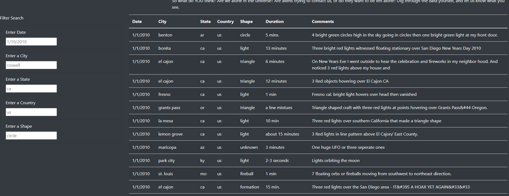
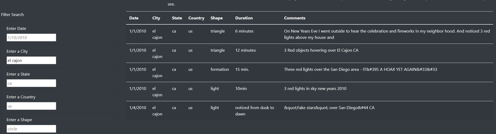
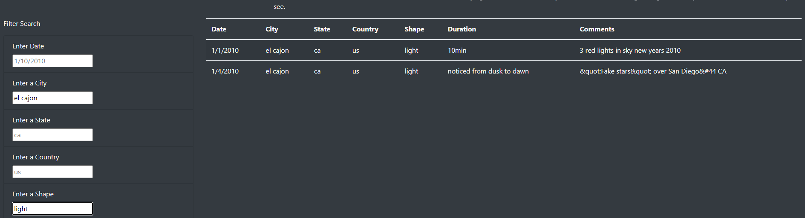
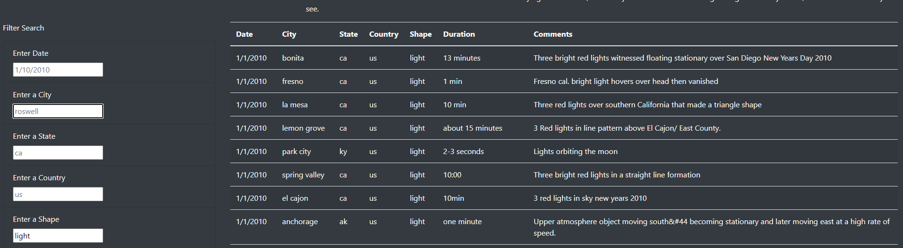

# UFOs
## Overview
This project was created to cleanly display a list of UFO sightings data (found in [data.js](static/js/data.js) on an interactive website, [index.html](index.html), where the data can be filtered by various criteria.  Much of the JavaScript implementation code can be found in the [app.js](static/js/app.js) file.
## Results - How-To
Here is a step-by-step example of how to use the filtering on the webpage.  Screenshots will focus on the table aspect of the page, rather than the entire page (as the text and images above are redundant).
### 1. Initial Table
Here is a look at the initial table, as the page first loads.  There are 5 different filters on the left hand side that can be filled in by typing and either pressing \<Enter\> or clicking off the input box (known as losing or changing "focus" in front-end terms).  The terms that appear in grey in the input boxes are merely placeholders, showing the user what sort of inputs the filters are looking for.

### 2. After One Filter
Here is how the table results changed when ***"el cajon"*** was set as the city.

### 3. After Two Filters
Here is how the results changed when ***"light"*** was set as the shape, as a second filter.

### 4. After Removing a Filter
Here is how the results expanded back when ***"el cajon"*** was removed as a filter, leaving only "light."

### Added Features
- Since the initial [data.js](static/js/data.js) file has all of the data in lowercase, I had the script convert the user input to lower case before comparing, so that ***"El Cajon"*** would still register as a match to "el cajon".

## Summary
There are a number of ideas and changes that we can look at as we envision the future of this dynamic website:

### Capitalization of Displayed Data
The current design displays everything completely "as-is" in the [data.js](static/js/data.js) file, including everything in lowercase.  Formatting cities, states, and countries to be capitalized could be a nice improvement in formatting.

### Scrollbar for the Table
Currently, the table displays its results merely in a table on the HTML page, which goes down ad-infinitum (or at least ad-random-access-memoriam).  Putting the table into a scrollable container would allow us to control the size of the table's displayed data, even allowing us to put additional features below the table and filters.

### What if we obtain much more data?
Currently, the data in [data.js](static/js/data.js) is rather limited, containing only data from 2 weeks in 2010 only in the US and Canada.  Expanding that data in the future will require some significant overhauling.  As an example, if there are 100 possible countries, it may be difficult for a user to know the country code for, say, Palau off the top of their head.

#### Changing the \<input\> tags from "type=text"
A possible solution to this would be to change the "text" style inputs to something more structured.

##### Dropdown Menus
Perhaps inputting all of the country abbreviations ahead of time, converting them to full names via a dictionary, and making the "country" input a box with a dropdown menu instead of a plain text box, might make for a more intuitive input method when much more data is available.  The same can be done with US states, and even shapes.  Cities would be unwise, as there would be far too many cities to try and have the user scroll through potentially hundreds if not thousands of options.

##### Date Ranges and Calendars
In a similar manner, maybe changing the date selection to a calendar widget (something like the JavaScript [datepicker](https://jqueryui.com/datepicker/)), and even setting a two dates for a range, might be a better way to filter by dates, offering the user flexibility with their date filter.
